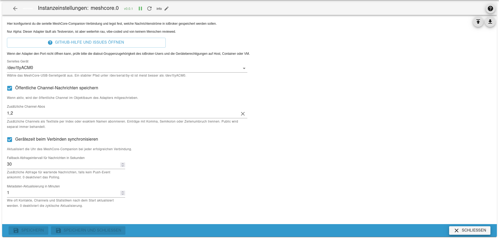
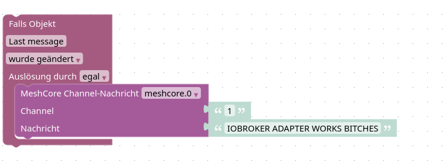

# ioBroker.meshcore

MeshCore companion adapter for ioBroker with serial connection setup, metadata sync, public channel storage, additional channel subscriptions, and private message history.

## Screenshots

Admin configuration and overview:



Blockly send blocks:



## Alpha Status

This adapter is an absolute, untested alpha.

It currently runs far enough to count as a test version, but it is still absolutely rough and should be treated as experimental murks.

It is also completely vibe-coded so far, and no human has reviewed the code yet.

- It has not been validated against a real production ioBroker system.
- It has not been validated against real MeshCore hardware end to end.
- Object model, admin config, message flow, and reconnect handling may still change.
- Do not use this in a critical environment without reviewing the code and testing it yourself.

## Current Scope

- Serial connection to a MeshCore companion device
- Admin UI for selecting the serial port
- Embedded admin overview on the main config page with device identity, public key, channel overview, and QR export
- Storage of MeshCore self info, device info, contacts, channels, and stats under a dedicated object tree
- Storage of public channel messages
- Subscription to additional channels by index or name
- Direct channel create/update from the admin config page
- Storage of incoming and outgoing private messages per contact
- Send states for public, channel, and private text messages
- Custom Blockly send blocks for public, channel, and private MeshCore messages

## Implementation Notes

This adapter was built on top of the official ioBroker adapter template and uses Liam Cottle's MeshCore JavaScript implementation for the MeshCore companion protocol side.

Current building blocks:

- ioBroker adapter scaffold generated with `@iobroker/create-adapter`
- MeshCore serial/protocol access implemented via `@liamcottle/meshcore.js`
- Adapter-specific object tree, admin configuration, and ioBroker state handling implemented in this repository

## Object Tree

The adapter uses its own object tree below the instance namespace:

- `info.*`
  Connection state, last error, last sync, configured port
- `meta.*`
  Self info, device info, contacts, channels, core stats, radio stats, packet stats
- `channels.*`
  Public and subscribed channel message history
- `private.*`
  Private message history per contact
- `commands.*`
  States for sending public, channel, and private messages

## Installation via GitHub Link

This repository is intended to be installable directly from the ioBroker admin web interface via GitHub.

After the repository is published, install it in ioBroker admin using the GitHub URL:

```text
https://github.com/goerdy/ioBroker.meshcore
```

Depending on your admin version, this is typically done via the custom installation dialog in the adapters page.

## Configuration

- Select the MeshCore serial device in the admin page.
- Enable or disable public channel storage.
- Add additional subscribed channels by channel index or exact name.
- Adjust reconnect delay, fallback polling interval, stats refresh, and message history size as needed.

## Admin UI

The adapter currently exposes one main config page with:

- Serial port selection
- Public channel handling
- Additional subscribed channels
- Reconnect and polling parameters
- Device identity, public key, QR export, and known channels
- Direct channel create or update on the connected MeshCore device

Important detail:

- Creating or updating a channel in the admin config page writes the channel to the MeshCore device.
- If you also want message storage for that channel, add the channel index or exact channel name to the subscribed channels setting.

## Blockly Send Blocks

The adapter provides custom Blockly send blocks inside the `Sendto` category:

- `MeshCore public message`
  Writes to `commands.public.*` and sends a public MeshCore text message
- `MeshCore channel message`
  Writes to `commands.channel.*` and sends a text message to a selected MeshCore channel
- `MeshCore private message`
  Writes to `commands.private.*` and sends a private text message to a selected MeshCore target

These blocks require a JavaScript adapter version that picks up custom adapter Blockly files correctly. For compatibility, the adapter currently exposes both `common.blocks` and the legacy `common.blockly` flag.

## Serial Device Permissions

If the adapter reports a serial error like:

```text
Permission denied, cannot open /dev/ttyACM0
```

then the serial device exists, but the ioBroker process cannot open it yet.

On Linux systems the device often needs group ownership and mode like this:

```bash
chgrp dialout /dev/ttyACM0
chmod 660 /dev/ttyACM0
```

The ioBroker runtime user also needs to be a member of the `dialout` group, for example:

```bash
usermod -aG dialout iobroker
```

This fixed the issue in a Proxmox LXC setup where the USB serial device had already been passed through to the container.

Notes:

- After changing group membership, a restart of the ioBroker service or container is usually required.
- In Proxmox LXC, device passthrough alone may not be enough if the device permissions inside the container are still too restrictive.
- `/dev/ttyACM0` may change after reconnects or reboots. If available, a stable path under `/dev/serial/by-id/` is usually the better choice.

## Development

```bash
npm install
npm run lint
npm run check
npm test
```

## Verification Status

Verified locally on August 5, 2026:

- `npm run lint`
- `npm run check`
- `npm test`

Not verified end to end:

- Real serial connection to MeshCore hardware
- Full ioBroker integration with physical device traffic
- Long-term field stability with real-world MeshCore traffic and reconnect edge cases

## Changelog

### 0.0.2

- Added Blockly send block documentation
- Added README screenshots for admin UI and Blockly blocks
- Added legacy `common.blockly` compatibility flag for JavaScript Blockly detection

### 0.0.1

- Initial alpha release
- Added MeshCore serial adapter base
- Added admin configuration for serial port and channel subscriptions
- Added admin overview tab with public key details and QR export
- Added direct channel create and update support from admin
- Added metadata, channel, and private message object tree
- Added send states for public, channel, and private text messages

## License

MIT License

Copyright (c) 2026 goerdy <iobroker@philipp-guerth.de>
